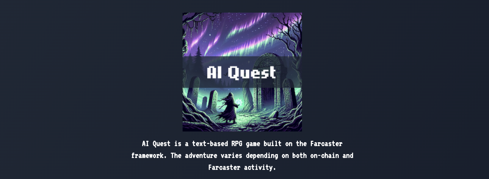

# AI Quest

Shape your RPG world & power up social gaming with your onchain activity! AI Quest is a text-based RPG game built on the Farcaster framework. The adventure varies depending on both on-chain and Farcaster activity.

## Live App

https://ai-quest-frameworks.vercel.app/

## Demo Video

TBD

## Description

This project fuses a text-based RPG with blockchain technology, utilizing AI for an enhanced experience.

Introducing a novel Farcaster frame, this platform offers an engaging and innovative social gaming experience.

Experience a classic dark fantasy RPG where users progress interactively through dynamic scenarios, ultimately creating Video NFTs from their unique stories.

## Technical Details

- Utilizes Frames.js to construct a Farcaster Frame, ensuring compatibility with the open frame standard.
- Employs Pinata analytics to transmit and retrieve data on user interactions with the frame.
- Integrates Airstack to acquire Farcaster and on-chain activity data via OnchainKit.
- Utilizes Livepeer for video generation and uploading.
- Leverages Base Sepolia for NFT minting with generated content.
- Utilizes the OpenAI API for the creation of text and images, dynamically changing content based on user interaction and activity from Farcaster and the blockchain.
